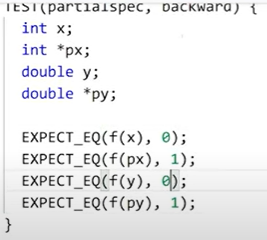

# Class templates

## 3 frontend fundamental principles

### Семантический анализ

1. Разрешение перегрузки (имен)
2. Вывод типов
3. Инстанцирование + разрешение зависимых имен 

## Разрешение имен шаблонных функций

Преобразования бывают:

1. Стандартные

   

2. Пользовательские преобразования

Например, `implicit operator`, `implicit class constructor`.

**Цепочка преобразований состоит из 0-1 пользовательского преобразования и хвоста+головы стандартных преобразований. Они ранжируются только по длине хвоста!**

Тут более одного пользовательского преобразования - ошибка. Эта такая защита от метопрограммирования на разрешении имен.

Специализации не участвуют в перегрузках (в разрешении имен).

Если убрать 2 последние строчки - выиграет 2. Иначе - 3.

## Перегрузка: шаблон против шаблона

Выиграет 2.

Здесь между шаблонами строит отношение частичного порядка, и выбирает тот кейс, который более узкоспециализирован.

Если отношение частичного порядка не удалось сделать - ошибка компиляции.

## Метод самок оленей

Специализация принадлежит победившей перегрузке шаблонов.

Шаблон - олень, специализация - самка. 3й олень пришел позже 1-го оленя, а потому не участвовал в борьбе.

## Олени и крокодилы

Выиграет 1, т.к. 2 в данном случае является крокодилом.

3. Функции с троеточиями (с самым низким приоритетом по разрешению имен)

## Точка объявления

Точка объявления - это место, где компилятору становится известно имя.

У `fnode` можно опустить `Т`, т.к. объявление уже произошло.

## Немного о метапрограммировании 

Метапрограммировать можно на инстанцировании.

Здесь порождается зависимый процесс инстанцирования.

## Специализация после инстанцирования - опасная вещь

> Об ODR:
>
> ODR for noinline functions - 1 for executable
>
> ODR for types - 1 for 1 translation unit 

Специализации типов нужно делать в заголовочниках, иначе могут возникнуть проблемы со специализациями.

В danger2.cc мы делаем forward declaration struct D и специализацию.

 

# Частичная специализация шаблонных классов

В классах после того, как шаблонный параметр определен в непосредственном контексте, он в том же виде пробрасывается в тело шаблонного класса.

Задачи на частичную специализацию

Нельзя заводит специализации, которые ничуть не менее обшие.

Причем не обязательно в частичной специализации должно быть <= число шаблонных параметров `primary template`.

**Частичная специализация для функций невозможна. Но мы можем завести частичные специализации для класса со статическим методом.**

Можно ли считать частичную специализацию формой наследования?

Нет, не выполняется принцип подстановки Лисков (один из принципов SOLID) - derivative is a base. 

Как писать шаблоны методов?

Но может возникать синтаксическая неоднозначность. Поэтому лучше перестраховываться. Для шаблонных методов можно явно указать:

А как писать специализацию для шаблононных методов?

Это трактуется как частичная специализация функции с одним неявным аргументом - this. **Частичная специализация функций невозможна.**

Как параметризовать методы?

## Виды типизации

* Статическая:
  * Номитативная
  * Утиная

