# Лекция 3

## Вывод типов в классах

Это поддержано с помощью вывода типов в конструкторах классов.

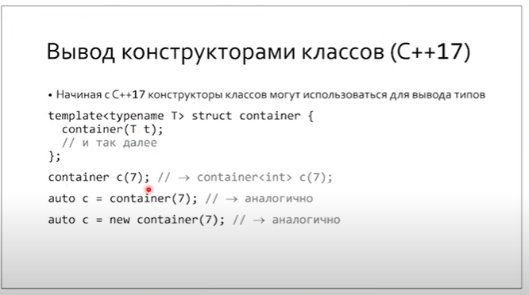

Но в классах не всегда может вывестись тип.

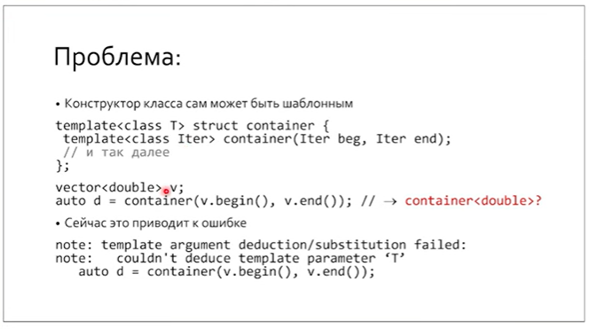

Это решается с помощью хинтов.

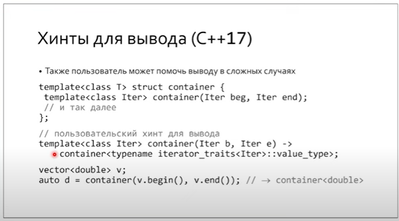

Хинты применимы и для классов, в которых нет конструкторов, есть только агрегатная инициализация.

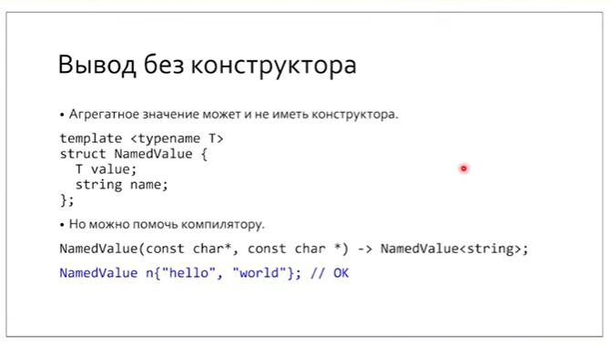

У классов с конструкторами есть implicit hints.

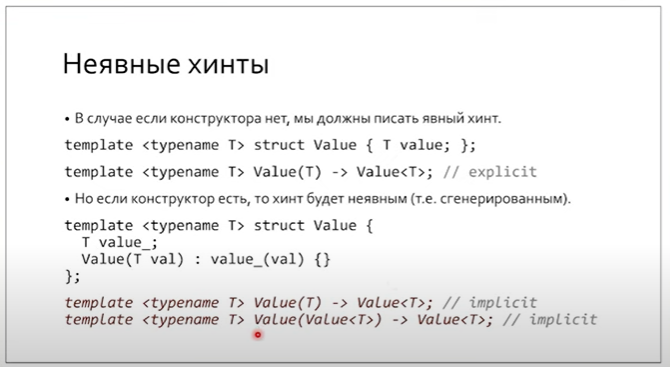

# Лекция 4

В предыдущей лекции мы использовали переходник типов для того, чтобы симмитировать частичную специализацию для шаблонных методов.

> Ключевое слово `private` сохраняет не данные, а имена.

*В классах сначала выигрывается перегрузка, а потом обращается внимание на модификаторы полей/методов.* **Т.е. при перегрузке  модификаторы доступа игнорируются.**

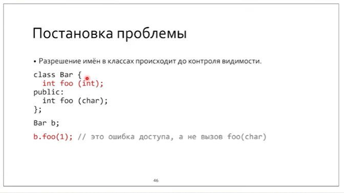

А как насчет  порядка разрешения имен и инстанцирования?

## Двухфазное разрешение имен в шаблонах

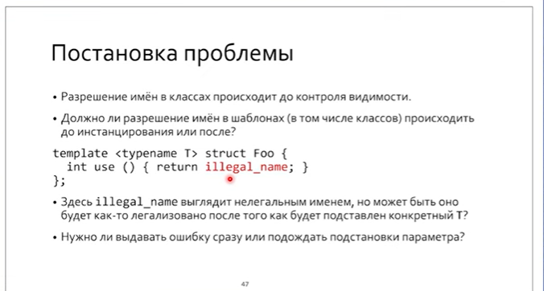

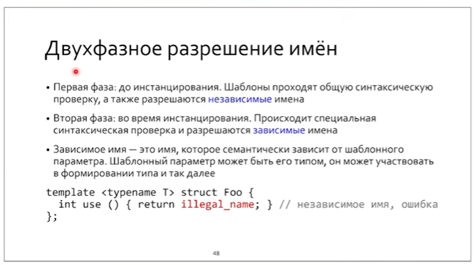

Т.е. откладываются те имена, которые, грубо скажем, зависят от шаблонного параметра.

### Разрешение зависимых имен откладывается до подстановки шаблонного параметра!

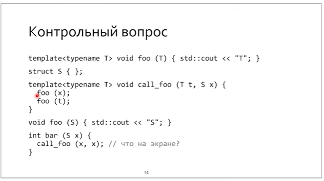

На экране будет:

```
T S
```

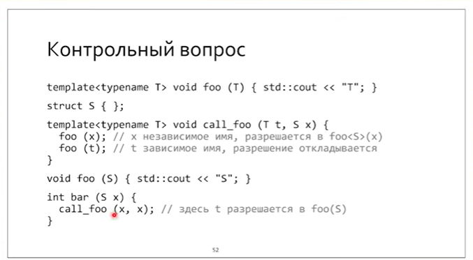

### Пример Вандерворда

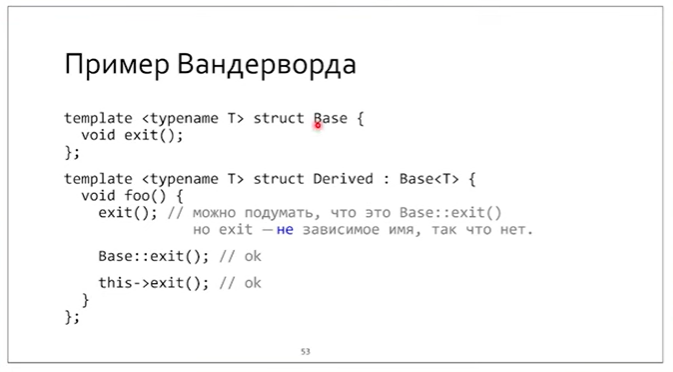

Проблема в том, что exit - не зависимое от шаблонного параметра имя, и разрешение имени не отложится во вторую фазу, и вызовется `std::exit()`. Ключевое слово`this`решает эту проблему.

### Немного о дизамбигуации

Дизамбигуация требуется для зависимых от шаблона имен/методов.

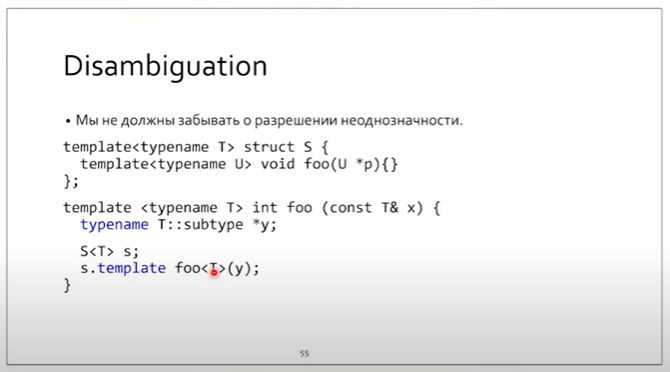

> С высокой вероятностью disambiguation требуется, когда шаблонный параметр еще не подставлен.


### Олени, самки оленей для шаблонных классов

Как выбирается частичная специализация для классов? 

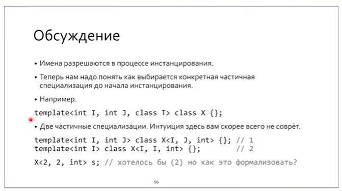

**Если неизвестно, какой должен быть ответ - есть интуитивное правило: более специальное является приоритетным.**

Как выстроить отношение частичного порядка между частичными специализациями классов?  В функциях мы использовали вывод типов, но в классах может не быть конструкторов, и вывод типов

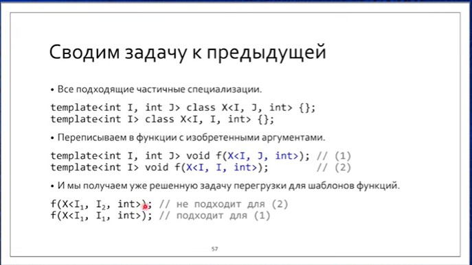

# Введение в модули

Объявление (`forward declaration`), определение, объявление + определение.

Файл из объявлений, часть из которых может содержать определения, есть **единица трансляции.**

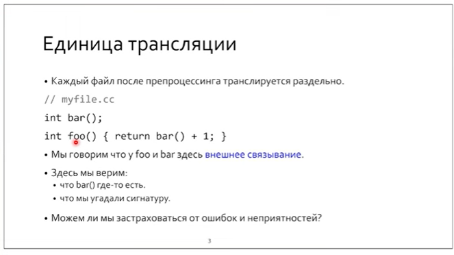

Единицы трансляции нужны для разделения компиляции, для создания библиотек (как статических, так и динамических).

## Одна из проблем, решаемая заголовочным файлом

Чтобы застраховать соответствие объявления определению, можно использовать заголовочный файл с вынесенными в него определениями, и включить его во все места, где есть объявления и определения.

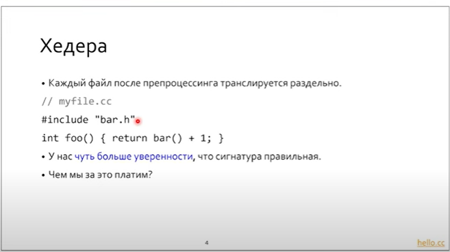

## Виды связываний

* Никакое 
* Внешнее
* Внутреннее
* Модульное

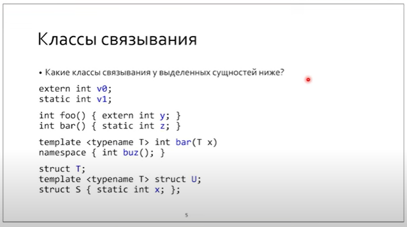

1 - внешнее

2 - внутреннее

3 - внешнее

4 - никакое (не может прийти из другого модуля)

5 - template declaration - гипотетически может быть вызван из другого модуля

6 - внутреннее

7 - внешнее

8 - внешнее

9 - внешнее

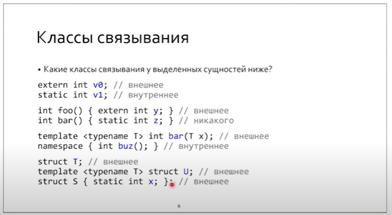

Нужно задаваться двумя вопросами:

* Definition может использоваться в другом модуле?
* Declaration может прийти из другого модуля

> Scope функции не определяет namespace
>
> Scope class определяет namespace

У библиотеки / исполняемого файла есть таблица символов. Однако в случае когда линковка состоялась, то перелинковка имен невозможна (по умолчанию).

> Почему не выдаем ошибку линкера в случае ODR violation?

В этом случае не возможно было бы слинковать стандартную библиотеку:

```
libgсс + link ligcc; libgcc + link libc 
```

Многопроходный линкер - это Ад.

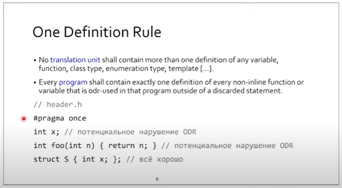

По стандарту типы с одним именем в разных единицах трансляции в одной программе должны по-лексемно совпадать. В противном случае - UB.

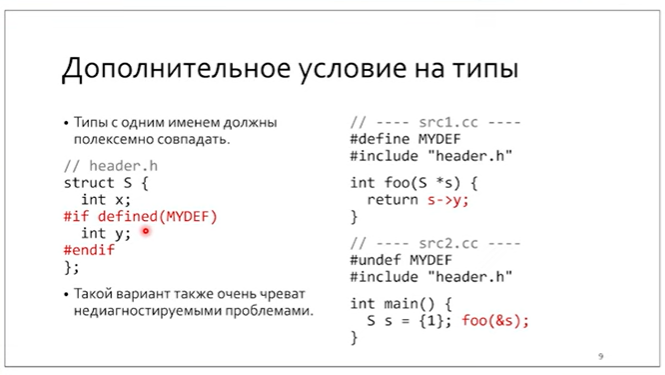

 

## История с inline

Подставить тело функции в место ее вызова - это определение устарело для inline. Да, оно на 30% повышает вероятность inline.

Современная трактовка - исключение из ODR. Это позволит написать тело функции в заголовочном файле без опаски нарушения ODR.

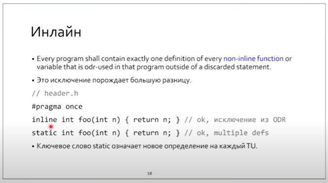

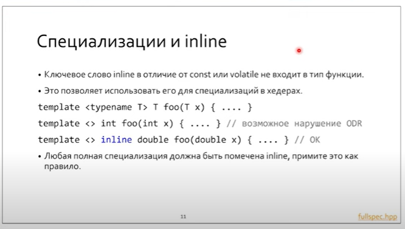

Так как специализации нужно иметь в заголовочном файле (см. лекцию 3), то для того, чтобы обезопасить себя от ODR violation или UB лучше писать inline in header.

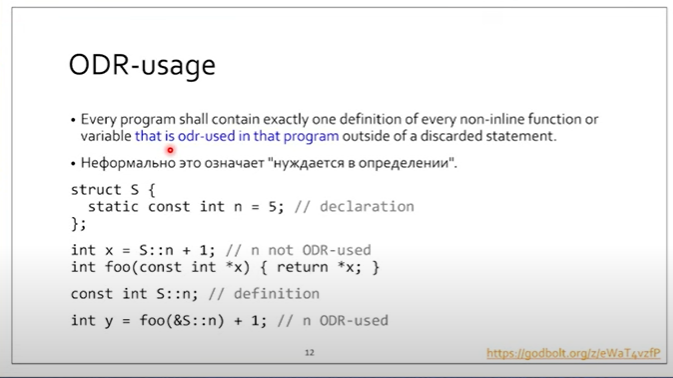

Если переменная нигде в программе не ODR-used, то ее definitions может быть сколько угодно.

Constexpr выкидывает ветки из инстанцирования.

