# Заголовочники и модули

```C++
#include <iostream>
int main() { 
    std::cout << "Hello\n";
}
```

После препроцессинга это свыше 30 000 строк!

```bash
# dump preprocessor
g++ prog.cc -E -o prog.i
```


Решение - **precompiled headers**.

> ```bash
> g++ -c header.hpp -o header.hpp.gch # gimple IR
> ```
>
> Компилятор достаточно умен, чтобы распознать расширение и сгенерировать precompiled header. **GCC по-другому ведет себя на заголовочниках.**

 

```C++
// header.hpp
#include <iostream>

// prog.cc
#include "header.hpp"
int main() {
    std::cout << "Hello\n";
}
```

Однако `g++ prog.cc -E -o prog.i` выдаст 30 000. Не оптимизировалось?

Все работает, просто компилятор берет не те файлы:

```bash
mv header.hpp header.hpp_
g++ prog.cc -E -o prog.i # error
g++ prog.cc # OK! - here it uses precomiled header.hpp.gch

#correct variant
g++ prog.cc -E -fpch-preprocess -o prog.ii # contains 11 strings!!!
```

*Таким образом, можно перед компиляцией генерировать precompiled headers.* Они ищутся по тому же пути, что и обычные их родительские заголовочники.

Translation unit - superposition of declarations.


Минусы precompiled headers:

* Макросы не меняют поведение precompiled headers (они уже прекомпилированы и прошли не только стадию лексического и синтаксического, но и стадию семнтического анализа).
* Не решают проблему видимости символов. Их видимость определяется и фиксируется в момент создания прекомпилированных заголовочников.

Какие виды линковки есть:

* External linkage
* Internal linkage

Нужна функция, которая видна только для других функций этого precompiled header. При этом в отличие от internal linkage на не должна дублироваться в каждой единице трансляции. Это C++20 модули.

## C++20 Модули

*  Еще один класс linkage
* Управление видимостью
* Precompiled header

```C++
// first_module.cppm
// module is a set of translation units, one of them must be "export module"
export module fisrt_module;
int foo(int x) { return x;} // module linkage - available for every translation unit of this module (& only). In TUs of OTHER module it will be new independent symbol. В отличие от внутреннего связывания модульное связывание не подразумевает распространения имени на каждую единицу трансляции.

export int e = 42; // external linkage & one declaration for every place where module was included
export int bar() { return foo(e); } // internal linkage is availbale for using inside module 
```

```C++
export module A
struct Y;
struct X { Y *p; }; // не имеет отношения к Y из B
export module B;

struct X;
struct Y { X *p; }; // не имеет отношения к X из А
```

Не надо менять **CXXFLAGS**.

```C++
import first_module;

#include <cassert>

int main() {
    foo(2); // ошибка - вызов сущности со внутреннем связывания в модуле вне модуля!
    e = (bar() == 14); // ok
    assert(e);
}

// clang++ -fmodule-file=first_module.pcm first_module.cpm main.cc
```


## Как компилировать модули

```C++
# create module
clang++ --std=c++20 -fmodules --stdlib=libc++ --precompile first_module.cppm -o first_module.cpm

# create programm with modules
clang++ --std=c++20 -fmodules --stdlib=libc++ -fmodule-file=first_module.cpm first_module.cppm --std=c++20
```

> Если в namespace есть хотя бы один export, то экспортируется весь namespace (само имя)

## Импорт модулей в модули

```C++
export module first_extended;
import first_module; // приватное наследование
export int buz() { return bar(); } // тут bar не будет экспортироваться, как было показано в предыдущих примерах. тут bar поступает в другой модуль из импортировнного модуля.

```

```C++
export module first_extended;
export import first_module; // публичное наследование
export int buz() { return bar(); } // тут bar будет экспортироваться

```

```bash
clang++ --std=c++20 -fmodules --stdlib=libc++ --precompile first_module.cppm -o first_module.pcm
clang++ --std=c++20 -fmodules --stdlib=libc++ -fmodule-file=first_module.pcm --precompile first_extended.cppm -o first_extended.pcm
clang++ --std=c++20 -fmodules --stdlib=libc++ -fmodule-file=first_extended.pcm first_extended.pcm first_module.pcm main.cc
```

## Importable headers

Обычный `include` делает module linkage всех имен.

```C++
// тут import - директива препроцессора (не путать с предыдущими случаями)
// прекомпилирует заголовочник, делает из него модуль и импортирует модуль в место #include
import <iostream>
import "myheader.h" 
```

**Обычный импорт не показывает наружу макросы импортированного модуля, тогда как import заголовочного файла пробрасывает их.**

## Отсутствие циклических зависимостей в модулях

```C++
// M1.cppm
export module M1;
import M2;

// M2.cppm
export module M2;
import M3;

// M3.cppm
export module M3;
import M1; // compilation error
```

 ```C++
 // M1.cppm
 export module M1;
 export int foo() { return 14; }
 // M2.cppm
 export module M2;
 import M1;
 export int foo() { retrun 42; } // такое имя с module linkage уже существует
 
 /* Аналогичный пример */
 // M1.cppm
 export module M1;
 export int foo() { return 14; }
 // M2.cppm
 export module M2;
 export int foo() { return 42; }
 // prog.cc
 import M1;
 import M2;
 
 int x = foo(); // ODR violation
 ```

**Заметим, что при отсутствии вложенности модулей module linkage не приводит к конфликтам м/д модулями (следствие из определения module linkage).**

```C++
// M1.cppm
export module M1;
int x = 14;
export int* foo() { return &x; }

// M2.cppm
export module M2;
int x = 42;
export int* bar() { return &x; }

// сами иксы - тут разные переменные, и они не экспортируются.
```


Можно делать `export { /* stmt list */ }`, а также `export namespace`

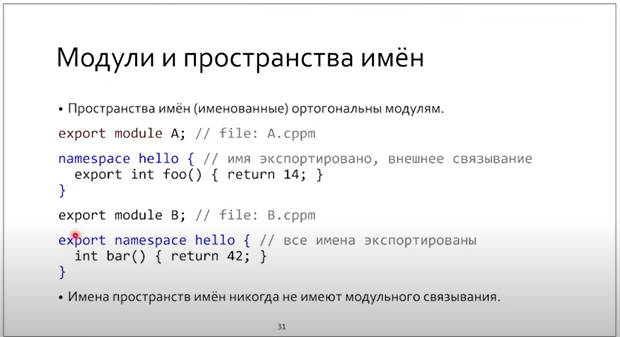

Нельзя экспортировать `using namespace`. Но можно экспортировать алиасы: `using T = int`. Нельзя экспортировать имена с внутренним и модульным связыванием.

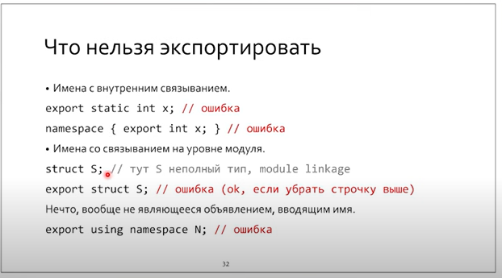

Иногда не хочется что-то в модуле (legacy header) не хочется добавлять в module linkage. В таком случае такие включение таких заголовочников выносится наверх - в глобальный модуль.

> В глобальном модуле могут быть **только директивы препроцессора**.

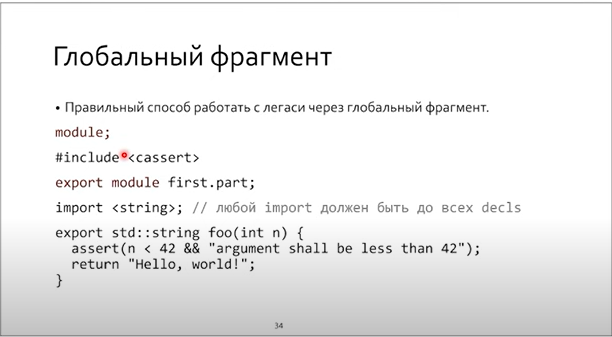

## Упрощенная схема модуля

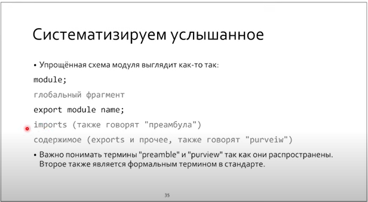

Модули можно комбинировать. Например, объединим модули А и Б в С:

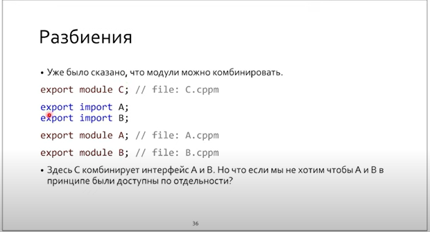

Можно делать разбиение модуля на части, каждая из которых может экспортироваться отдельно. Это позволяет разбить модуль на несколько единиц трансляции. 


Мы можем в интерфейсной единице модуля детали реализации вынести в отдельные единицы странсляции.

> `extern` нужен для того, чтобы у `e` не было module linkage.

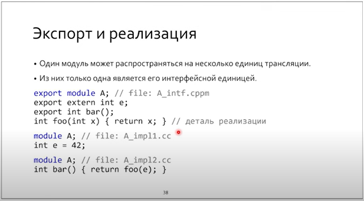

Приватные фрагменты можно определять либо в .cc, либо в самом файле модуля однократно после module perview

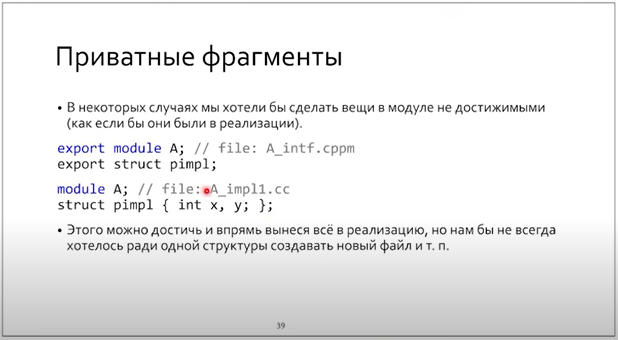

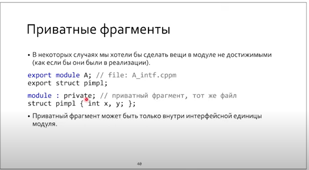

## Difference between visibility & reachability

То, что объявлено/определено как единица с модульным связыванием, при импорте **не видимо**, но может быть **достижимо**.

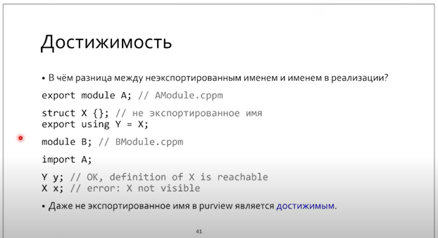

## Немного о зависимостях и их сборе

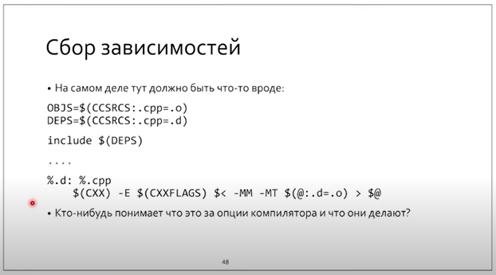

Тут написано: собрать зависимости с файлов .cpp и положить их в .d

> `@:.d=.o <=> left target = %.d --> %.o `

`-MM -MT` нужна для рекурсивной выдачи всех заголовочных файлов, от которых зависит цель.

Зачем выход с раширением .o? Чтобы сразу сгенерировать цель для Makefile.

*Директивы - это фаза лексера (лексический анализ)*. Проблема модулей в том, что они требуют синтаксического разбора.

## Модули и макросы

`#define #ifdef, #undef...` - все управляющие макросы не влияют на поведение модуля после его генерации. В скомпилированных модулях нет директив препроцессора. 

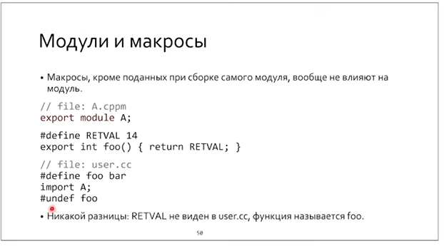

## Модули и шаблоны

